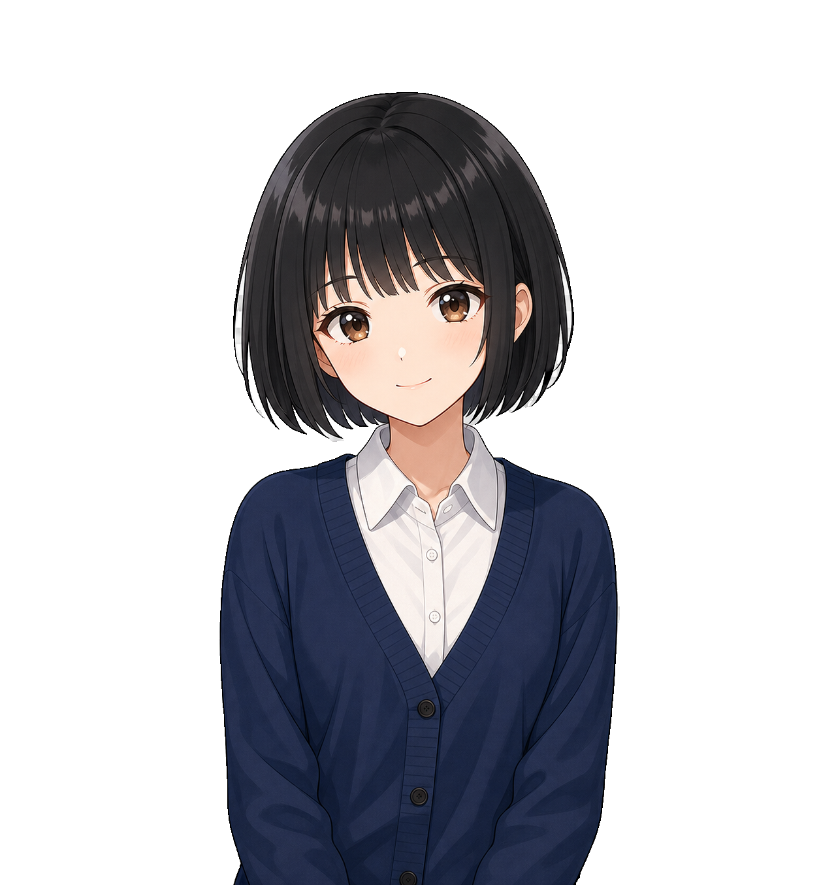
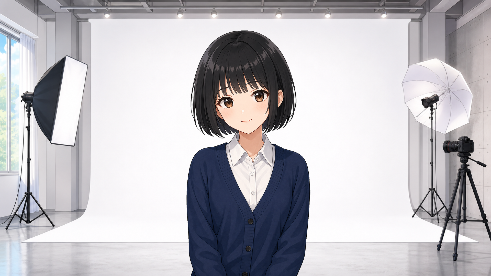
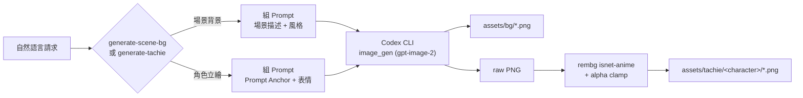

# Tachie Forge

[](https://opensource.org/licenses/MIT)
[](https://python.org/)

跟 Claude Code / Codex 說一句話，就生出 ADV/VN 風格的場景背景和角色立繪——自己在做的 Godot 文字冒險遊戲的素材產線。

| 背景 | 立繪 | 合成 |
|------|------|------|
|  |  |  |

## 核心概念

Tachie Forge 是兩個 Claude Code / Codex skill：`generate-scene-bg` 生成場景背景，`generate-tachie` 生成角色立繪（表情差分、透明背景）。用自然語言描述想要的場景或角色，agent 規劃 prompt、呼叫圖片生成、跑後製，把素材存進 `assets/`——不用開 Photoshop 手動去背，也不用碰 ComfyUI 的 node graph。

角色一致性靠 Prompt Anchor：把角色的外觀描述寫成一段固定文字，每次生成表情差分都原文帶入，加上把前一張圖丟進對話當視覺參照。這是 best-effort，不是 LoRA 訓練出來的像素級一致，效果有極限。

輸出是通用的 PNG（立繪去背成透明、背景是單張完稿），沒有 Godot 專屬的 export 或場景整合——素材生完自己手動丟進遊戲專案。這是刻意的邊界，不是漏做。

## 功能特色

| 功能 | 說明 |
|------|------|
| **generate-scene-bg** | 生成 ADV/VN 場景背景，支援時段/天氣變體（白天、黃昏、雨天等），拿既有背景當視覺參照維持構圖一致 |
| **generate-tachie** | 生成角色立繪，六種表情差分（neutral / smile / angry / sad / surprised / confused），Design Doc + Prompt Anchor 機制維持角色一致性 |
| **對話 UI** | 規劃中，尚未開始 |

## 系統架構



## 技術棧

| 技術 | 用途 | 備註 |
|------|------|------|
| Codex CLI | 呼叫 `image_gen` 生成圖片 | 需要 `OPENAI_API_KEY`，模型固定 gpt-image-2 |
| gpt-image-2 | 實際生圖模型 | 不支援原生透明背景，用棋盤格假透明 workaround |
| rembg (isnet-anime) | 立繪去背 | Python 套件，`pip install rembg[cpu]` |
| Python | 跑去背 + alpha clamp 後製 | 3.13 |
| Bash | `call-codex-imagegen.sh` 橋接腳本 | 處理 timeout / log / 錯誤分類 |

## 快速開始

### 環境需求

- [Codex CLI](https://github.com/openai/codex)（`npm i -g @openai/codex`）+ `OPENAI_API_KEY`
- Python 3.13
- Claude Code 或 Codex CLI（讀取 `skills/` 底下的 skill 定義）

### 安裝步驟

```bash
# 安裝 Python 依賴（含 rembg 去背用）
pip install -r requirements.txt

# 確認 Codex CLI 已安裝並設好 API key
export OPENAI_API_KEY="your-key"
codex --version
```

### 使用方式

`skills/` 底下每個 skill 是一份 `SKILL.md`（通用格式）+ `agents/openai.yaml`（Codex CLI 專屬設定）。直接對 agent 描述需求即可，例如：

> 「照 skills/generate-tachie/SKILL.md 幫我生成角色紅榴的立繪」
> 「幫我生成一張教室的黃昏背景」

## 專案結構

```
assets/
├── bg/                        # generate-scene-bg 輸出（圖 + .prompt.txt）
└── tachie/
    └── <character>/           # generate-tachie 輸出，含 design.md（Prompt Anchor）
scripts/
└── call-codex-imagegen.sh     # Codex CLI image_gen 橋接腳本
skills/
├── generate-scene-bg/
└── generate-tachie/
requirements.txt
LICENSE
```

## 技術限制

| 限制 | 說明 |
|------|------|
| **一致性是 best-effort** | Prompt Anchor + 視覺參照，不是 LoRA 級的像素一致，多次生成外觀可能微幅飄移 |
| **MVP 僅支援單一姿勢** | 一個角色目前只有一套姿勢＋六種表情差分，不同姿勢（坐姿、背面等）是刻意延後的 v2 範圍，不是遺漏 |
| **去背無法保證零瑕疵** | 複雜髮型（雙馬尾、蕾絲等會形成封閉輪廓的設計）殘留機率較高；髮絲邊緣的高光筆觸是模型畫進線稿的內容，不是後製能修的東西，合成時要避開背景深色區域 |
| **沒有 Godot 專屬整合** | 輸出是通用 PNG + prompt.txt，沒有 export 成 Godot resource 或場景節點，素材要手動丟進遊戲專案 |
| **對話 UI 尚未開始** | 三素材裡只完成 BG + 立繪，對話框/文字 UI 還在規劃階段 |

## 隨想

### 為什麼做這個

這個 repo 原本 fork 自 Agent Sprite Forge，一個用 Codex 生 2D pixel sprite / tilemap 的工具。做著做著發現自己真正要的不是像素風遊戲素材，是 ADV/VN 那種 Persona、逆轉裁判式的對話場景——場景立繪 + 對話框撐起整個畫面，不需要 tilemap、碰撞、engine wiring 那一整包東西。與其硬套一個為了不同目的做的工具，不如把同一套「用自然語言描述、agent 規劃 prompt、生圖」的方法論，重新對準 ADV/VN 這三種素材（BG、立繪、對話 UI）。

### 學到什麼

去背這件事踩了不少坑。一開始以為所有「髮際線白邊」都是同一種問題，調 alpha clamp、調色彩去污染、加重 erosion，有時候有效有時候完全沒用，一度以為是自己參數沒調對。後來放大看 rembg 處理前的原始棋盤格圖才發現：白邊分兩種，一種是背景真的沒去乾淨（能靠後製修），另一種是模型自己畫在線稿裡的高光筆觸（頭髮邊緣的裝飾性亮線、飄出去的單根髮絲）——這種後製完全碰不到，因為 rembg 正確地把它當前景保留，不是它的錯。

分辨方法很簡單：看原始生成圖，如果那個淺色元素在棋盤格背景上就已經看得到，那是畫出來的，不是去背殘留，後製救不了。這種只能靠兩件事解：prompt 明確禁止（對飄散髮絲有效），或乾脆讓合成背景在那個位置保持淺色，讓高光線自然融入看不出來——攝影棚白色背景就是這樣繞過去的。同樣道理，封閉輪廓（雙馬尾捲回碰到軀幹、圈狀配件）最好在角色設計階段就避開，而不是生成後才用 prompt 補救。早知道先看原圖再猜參數，能少走好幾輪。

## 授權

本專案採用 [MIT](LICENSE) 授權。

## 作者

子超 - [tznthou@gmail.com](mailto:tznthou@gmail.com)
